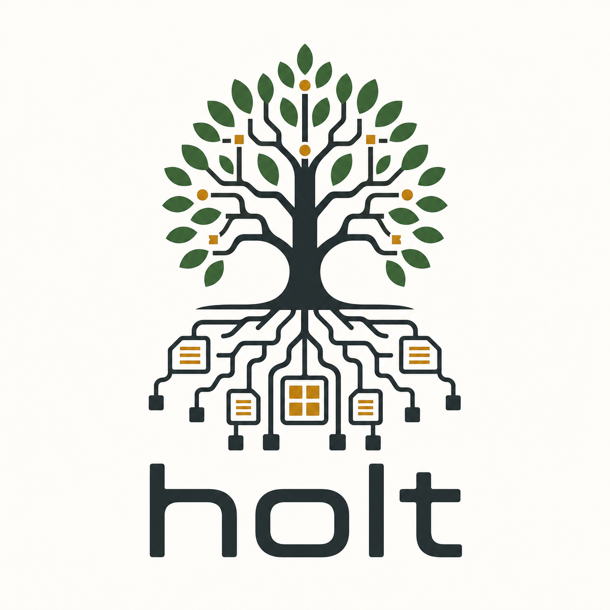

<p align="center">
  
</p>

# holt

[](https://crates.io/crates/holt)
[](https://docs.rs/holt)
[](https://github.com/feichai0017/holt/actions/workflows/ci.yml)
[](https://github.com/feichai0017/holt/blob/main/Cargo.toml)
[](LICENSE)

`holt` is an embedded Rust metadata engine built around a persistent
Adaptive Radix Tree. It is designed for **path-shaped keys**: S3 object
names, filesystem dentries, tenant namespaces, artifact catalogs, and
other workloads where point lookup and prefix listing dominate.

It is not trying to be a generic KV database. The point is narrower:
make metadata operations cheap without LSM read amplification,
compaction stalls, or a single global writer lock.

## Why holt

- **Persistent ART**: path compression, byte-wise routing, and
  `O(key.len)` point lookup.
- **Blob-framed storage**: 512 KB self-describing blob frames with
  cross-blob routing for large trees.
- **Metadata-native scans**: prefix range, `start_after`, key-only
  scans, and S3-style delimiter rollup.
- **Crash-safe persistence**: logical WAL, group commit, checkpointing,
  manifest replay, and reopen recovery.
- **Concurrent hot path**: optimistic reads and per-blob latching for
  disjoint subtrees.
- **Cold-read sidecar**: checkpointed lookup summaries can avoid pulling
  full 512 KB blobs for cold point reads.
- **Hardware-aware implementation**: SIMD search paths, hardware CRC32C,
  and Linux `io_uring` support.

## When it fits

Use holt when keys naturally look like paths and your service spends
most of its time doing:

- `get(path)`
- conditional create/update/delete
- prefix scan or paged list
- `list(prefix, delimiter="/")`
- metadata rename or small atomic batches

Typical examples:

- object-store metadata
- filesystem metadata
- lakehouse file catalogs
- artifact/package registries
- embedded metadata indexes for distributed systems

If your keys are random opaque bytes and your workload is mostly large
value streaming, analytics, full-text search, or vector search, use a
system built for that shape.

## Install

```toml
[dependencies]
holt = "0.6"
```

File-backed trees are Unix-oriented. Linux uses the `io-uring` feature
by default when available; non-Linux Unix targets use the normal file
backend. In-memory trees are available for tests and ephemeral indexes.

## Quick Start

```rust
use holt::{Durability, KeyPathBuf, TreeBuilder};

fn main() -> Result<(), Box<dyn std::error::Error>> {
    let tree = TreeBuilder::new("/var/lib/app/meta.holt")
        .buffer_pool_size(512)                       // 512 blobs = 256 MiB
        .durability(Durability::Wal { sync: false }) // async group-commit WAL
        .open()?;

    let mut key = KeyPathBuf::with_namespace(b"objects")?;
    key.push(b"bucket-a")?;
    key.push(b"images")?;
    key.push(b"01.jpg")?;

    tree.put(key.as_bytes(), br#"{"size":4096,"etag":"abc"}"#)?;
    assert!(tree.get(key.as_bytes())?.is_some());
    Ok(())
}
```

## Core API

Point operations:

```rust
tree.put(b"bucket/a.jpg", b"meta")?;
let record = tree.get_record(b"bucket/a.jpg")?.unwrap();

let ok = tree.compare_and_put(
    b"bucket/a.jpg",
    record.version,
    b"new_meta",
)?;
assert!(ok);

let deleted = tree.delete_if_version(b"bucket/a.jpg", record.version)?;
assert!(!deleted); // version changed above
```

Prefix listing:

```rust
fn list_bucket(tree: &holt::Tree) -> holt::Result<()> {
    for entry in tree.scan_keys(b"bucket/").delimiter(b'/').start_after(b"bucket/a/") {
        println!("{:?}", entry?);
    }
    Ok(())
}
```

Atomic metadata batch:

```rust
let committed = tree.atomic(|b| {
    b.put_if_absent(b"dirs/a/", b"dir");
    b.assert_prefix_empty(b"dirs/a/tmp/");
    b.rename(b"dirs/a/old", b"dirs/a/new", false);
})?;
```

Multi-tree database:

```rust
let db = holt::DB::open("/var/lib/app/db.holt")?;
let dentries = db.open_tree("fs/dentry")?;
let inodes = db.open_tree("fs/inode")?;

db.atomic(|txn| {
    txn.tree("fs/dentry").put(b"/home/a.txt", b"inode:42");
    txn.tree("fs/inode").put(b"42", b"{...}");
})?;

assert!(dentries.get(b"/home/a.txt")?.is_some());
assert!(inodes.get(b"42")?.is_some());
```

## Persistence Model

Holt separates foreground metadata mutation from durable blob
checkpointing:

- WAL records make acknowledged mutations replayable.
- Checkpoints flush dirty blob frames and compact the manifest.
- A cold lookup sidecar is rebuilt from checkpointed blobs and is never
  the source of truth.
- `Durability::Wal { sync: false }` is the default throughput mode.
  Use `sync: true` when every committed mutation must force WAL sync.

## Benchmarks

Benchmark code lives in the separate non-published package under
[`benches/`](benches/README.md). Public results are in
[`benches/RESULTS.md`](benches/RESULTS.md).

```sh
cargo bench --manifest-path benches/Cargo.toml --bench main

HOLT_STRESS_N=20000000 \
HOLT_STRESS_POINT_OPS=1000000 \
HOLT_STRESS_LIST_OPS=1000000 \
cargo bench --manifest-path benches/Cargo.toml --bench stress -- objstore
```

The headline workload is metadata, not random-value KV. The strongest
paths are point lookup, key-only prefix scan, delimiter rollup, and
conditional metadata updates.

## Project Status

Holt is pre-1.0. The public API is intentionally small and stable within
a minor release, but minor releases may still break source compatibility
before 1.0. Pin exact versions for production evaluation:

```toml
holt = "=0.6.0"
```

The engine is covered by unit, integration, property, fuzz, soak, and
formal-model tests. See [`CHANGELOG.md`](CHANGELOG.md) for release
notes, [`ARCHITECTURE.md`](ARCHITECTURE.md) for the deep design, and
[`ROADMAP.md`](ROADMAP.md) for planned work.

## License

MIT. See [`LICENSE`](LICENSE).
